<div align="center">

# 🏆 PFTUS — Blockchain-based Public Fund Tracking & Utilization System

### 🥈 1st Runner-Up — Epoch'26 | Vemana Institute of Technology, Bengaluru

<br/>


<br/>

> *"We didn't just build a project. We built the future of government accountability."*

> *"This isn't a hackathon submission — it's a movement."*

</div>

---

## 🥈 Epoch'26 Winners — 1st Runner-Up

> 🏫 **Epoch'26** — 24-Hour Hackathon organised by **Vemana Institute of Technology, Bengaluru** (2026)
>
> 24 hours. Zero sleep. One idea that could change how governments handle public money.
> We came, we built, and we walked away as **1st Runner-Up** — and honestly, the project speaks for itself.

<div align="center">

| | | | |
|---|---|---|---|
| 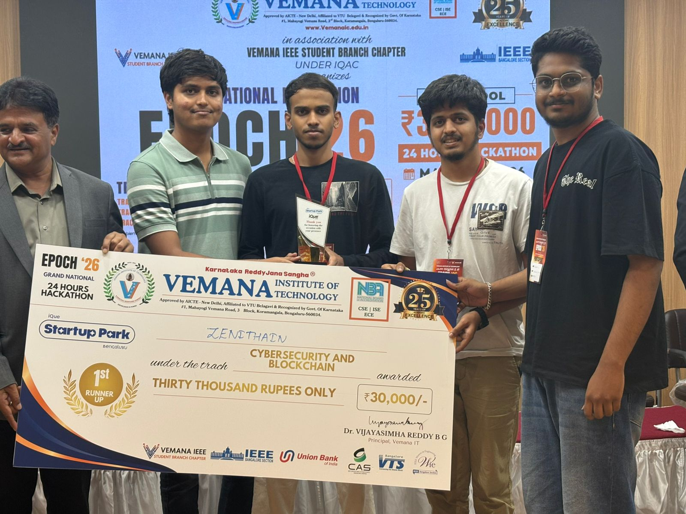 | 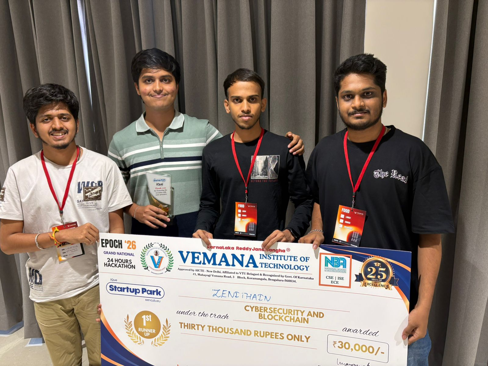 |  | 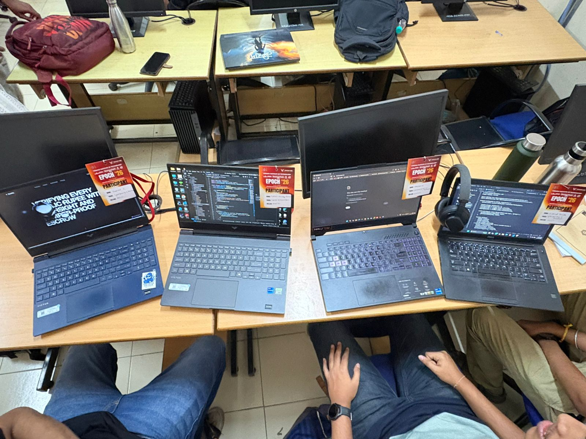 |

</div>

---

## 🌟 What Is PFTUS? (And Why It's The Greatest Thing Since Satoshi Nakamoto)

> **PFTUS** = **P**ublic **F**und **T**racking & **U**tilization **S**ystem

Government money disappearing into thin air? Contractors getting paid for work never done? Your tax rupees funding ghost projects? **NOT ANYMORE.**

We built a **bulletproof, blockchain-powered, NFT-stamped, zero-knowledge-verified, AI-scored, fully transparent** system that makes government fund management so honest it literally **cannot be corrupted**.

This is not a concept. This is not a prototype. **This is a fully working, deployed, battle-tested Web3 application** that combines:

- 🔗 **Smart Contracts** on Polygon
- 🖼️ **NFT-based Audit Stamps** (ERC-721)
- 🔐 **Zero-Knowledge Proofs** for privacy-preserving transparency
- 📊 **Public Trust Index** — a live corruption detector
- 🌐 **Multi-role Dashboard** for Government, Contractors, Auditors & Citizens

**One system. Zero corruption. Infinite accountability.**

---

## 💀 The Problem (It's Worse Than You Think)

Every year, **trillions of dollars** in public funds vanish into:

| Problem | Impact |
|---|---|
| ❌ Zero transparency in fund allocation | Citizens have no idea where their money goes |
| ❌ Delayed and manipulated utilization reports | Fake data submitted months later |
| ❌ Rampant misallocation & corruption | Funds diverted before work even begins |
| ❌ No real-time public visibility | By the time audits happen, money is gone |
| ❌ Paper trails that get "lost" | Convenient for corrupt officials, terrible for everyone else |
| ❌ No accountability for contractors | Get paid, disappear, repeat |

**The system was broken by design. We fixed it with blockchain.**

---

## ⚡ Our Solution (The One That Won First Place)

We built a **4-role, smart-contract-driven** ecosystem where:

```
🏛️ GOVERNMENT   →   Creates projects & locks funds in escrow
🔨 CONTRACTORS  →   Request milestone releases with proof
🔍 AUDITORS     →   Verify proofs & trigger fund releases
👥 CITIZENS     →   Watch everything in real-time (no wallet needed!)
```

Every single action is:
- **Recorded on-chain** — immutable, permanent, tamper-proof
- **Publicly visible** — no hiding, no excuses
- **Cryptographically verified** — math doesn't lie, and neither does this

---

## 🖥️ Screenshots

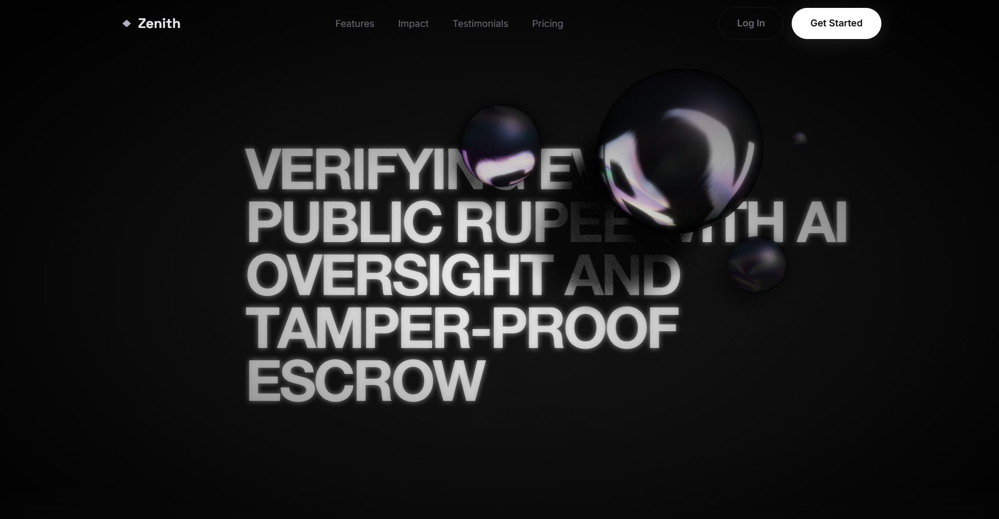

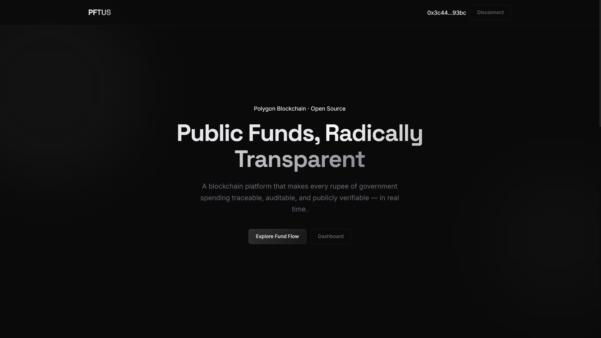

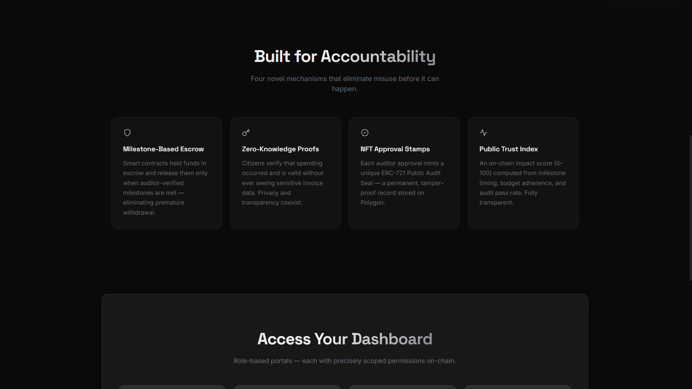

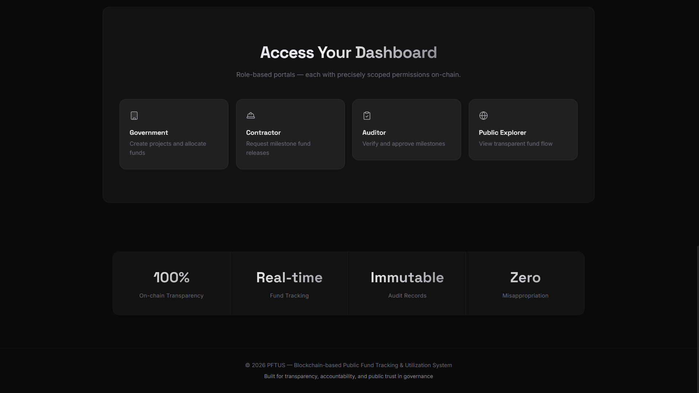

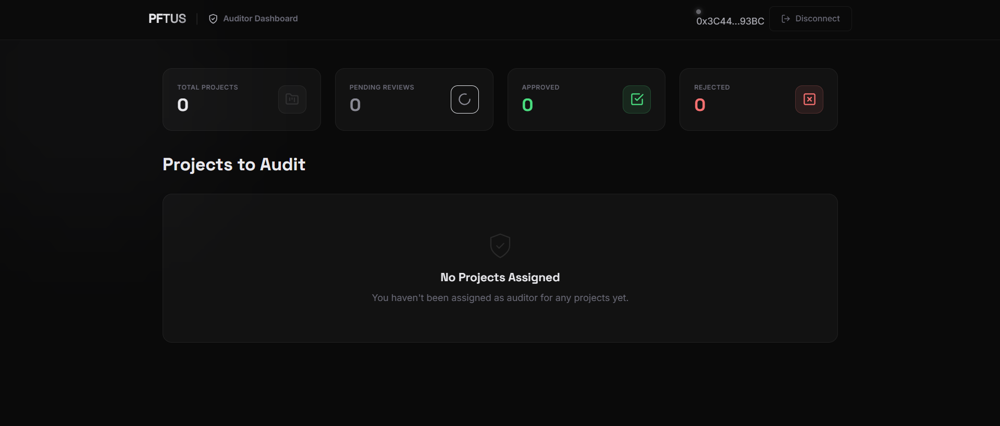

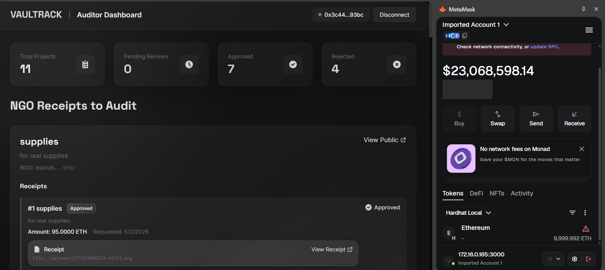

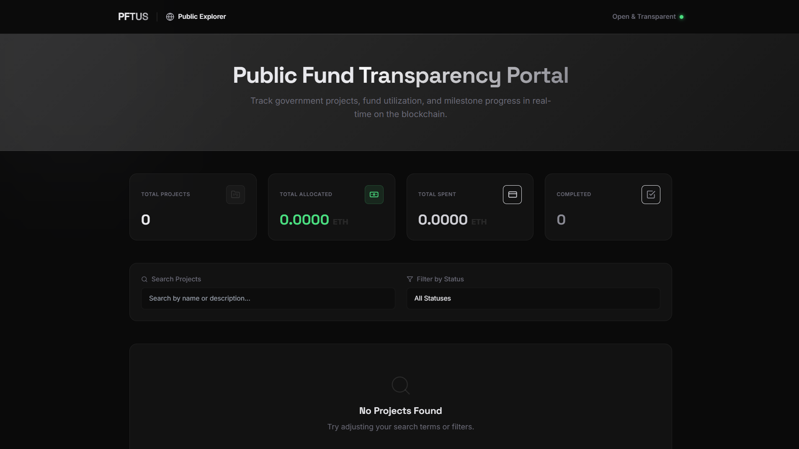

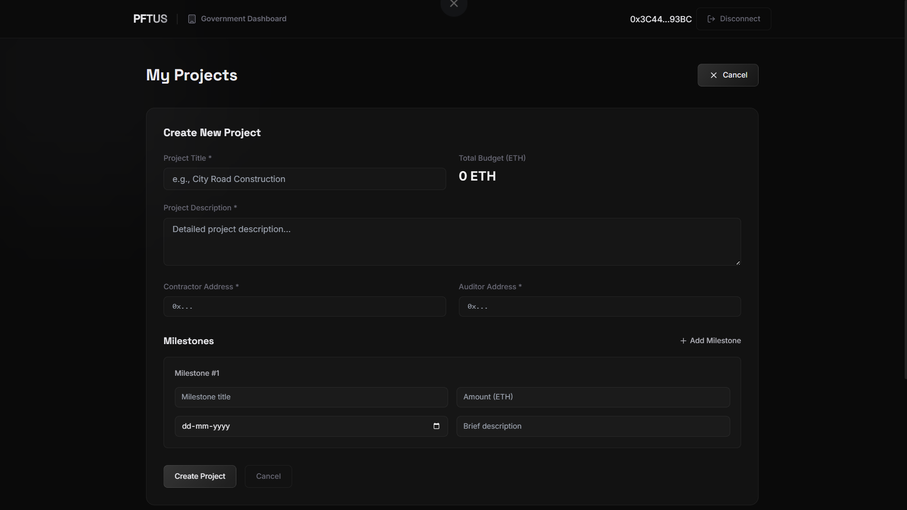

---

## 🚀 5 Novel Features That Made Judges Drop Their Jaws

### 🥇 Feature 1: Milestone-Based Escrow Smart Contract
> *"Not a single rupee leaves until work is proven complete."*

Funds are **locked in a smart contract escrow** and released ONLY when:
- Contractor submits cryptographic proof of completion
- Auditor verifies and approves the milestone
- The blockchain itself executes the transfer

No human can override this. No politician can redirect this. **The code IS the law.**

---

### 🥈 Feature 2: NFT-Based Audit Approval Stamps (ERC-721)
> *"Every milestone approval gets minted as an NFT — permanent, public, and beautiful."*

When an auditor approves a milestone, a unique **"Public Audit Seal" NFT** is automatically minted. This NFT is:
- **Immutable** — cannot be deleted or altered
- **Publicly viewable** — anyone can verify authenticity
- **Blockchain-native** — lives forever on Polygon

This means even 50 years from now, you can look up any project and see exactly who approved what, when, and why.

---

### 🥉 Feature 3: Zero-Knowledge Proof (ZK-Lite) Verification
> *"Citizens verify spending WITHOUT seeing sensitive invoices. Privacy + Transparency = solved."*

We implemented a **ZK-lite verification system** where:
- Citizens can **prove** funds were used correctly
- Without exposing **sensitive contractor invoices**
- Without revealing **personal financial data**

This is the holy grail of public finance — full accountability with zero privacy invasion.

---

### 🏅 Feature 4: Public Trust Index / Impact Score
> *"A single number that tells you if your government is trustworthy. Updated live."*

Every project gets a **0-100 Impact Score** calculated from:

```
📊 Impact Score Formula:
━━━━━━━━━━━━━━━━━━━━━━━━━━━━━━━━━━━━━━━━━━━━
  On-Time Milestone Completion  ×  40%
  Budget Adherence              ×  30%
  Audit Approval Rate           ×  20%
  Transparency Score            ×  10%
━━━━━━━━━━━━━━━━━━━━━━━━━━━━━━━━━━━━━━━━━━━━
  🟢 85-100 → EXCELLENT  (Your tax money is safe)
  🟡 70-84  → GOOD       (Mostly fine)
  🟠 50-69  → AVERAGE    (Keep watching)
  🔴 0-49   → POOR       (Sound the alarms)
```

---

### 🎖️ Feature 5: Real-Time Audit Trail Explorer
> *"A live, beautiful dashboard showing every single transaction from creation to completion."*

Citizens don't need to trust the government anymore. They can **verify** everything:
- 📅 Complete project timeline
- 💰 Fund allocation & utilization
- 📈 Progress bars updated in real-time
- 🔗 Blockchain transaction hashes for every action

**Don't trust. Verify. On the blockchain.**

---

## 🏗️ System Architecture — Built Like A Tank

```
┌─────────────────────────────────────────────────────────────────────┐
│                        BLOCKCHAIN LAYER                              │
│              (Polygon Mumbai Testnet / Local Hardhat)               │
│                                                                      │
│  ┌────────────────────┐  ┌──────────────────┐  ┌─────────────────┐ │
│  │ PublicFundProject  │  │  ApprovalNFT     │  │ ImpactScore     │ │
│  │  Smart Contract    │  │  ERC-721         │  │ Calculator      │ │
│  │  (Main Logic)      │  │  (Audit Stamps)  │  │ (Trust Index)   │ │
│  └────────────────────┘  └──────────────────┘  └─────────────────┘ │
│                                                                      │
│  ┌────────────────────────────────────────────────────────────────┐ │
│  │              ZKVerifier Contract (Privacy Layer)               │ │
│  └────────────────────────────────────────────────────────────────┘ │
└─────────────────────────────────────────────────────────────────────┘
                                   ▲
                                   │  ethers.js v6
                    ┌──────────────┼──────────────┐
                    │              │              │
           ┌────────▼─────┐ ┌─────▼──────┐ ┌────▼────────┐
           │  Government  │ │ Contractor │ │   Auditor   │
           │  Dashboard   │ │ Dashboard  │ │  Dashboard  │
           │  (Allocate)  │ │ (Request)  │ │  (Verify)   │
           └──────────────┘ └────────────┘ └─────────────┘
                                   │
                          ┌────────▼────────┐
                          │ Public Explorer │
                          │  (No wallet!)   │
                          │ Citizen Portal  │
                          └─────────────────┘
```

---

## 🛠️ Tech Stack — We Chose Only The Best

| Layer | Technology | Why We Chose It |
|---|---|---|
| 🔗 Smart Contracts | Solidity 0.8.20 | The gold standard for EVM smart contracts |
| 🧰 Dev Framework | Hardhat | Industry-leading Ethereum dev environment |
| ⛓️ Blockchain | Polygon Mumbai Testnet | Lightning fast, dirt cheap, fully EVM compatible |
| ⚛️ Frontend | Next.js 14 + React 18 | Server-side rendering, blazing fast UX |
| 🎨 Styling | Tailwind CSS | Utility-first, pixel-perfect, responsive design |
| 🔌 Web3 | ethers.js v6 | Best-in-class Ethereum library |
| 🖼️ NFTs | ERC-721 | Battle-tested NFT standard |
| 🔐 Security | OpenZeppelin v5 | The most trusted smart contract library on Earth |
| 🔍 Testing | Hardhat + Ethers | Comprehensive contract testing suite |

---

## 📦 Project Structure

```
PFTUS/
├── 📁 contracts/                     # Smart contracts (The Brains)
│   ├── PublicFundProject.sol         # Main fund management contract
│   ├── ApprovalNFT.sol               # ERC-721 NFT audit stamps
│   ├── ImpactScoreCalculator.sol     # Trust index engine
│   └── ZKVerifier.sol                # Zero-knowledge verification
│
├── 📁 scripts/                       # Deployment scripts
│   └── deploy.ts                     # One-command deploy to any network
│
├── 📁 frontend/                      # Next.js Application (The Face)
│   ├── app/
│   │   ├── government/               # Government dashboard
│   │   ├── contractor/               # Contractor dashboard
│   │   ├── auditor/                  # Auditor dashboard
│   │   └── explorer/                 # Public explorer
│   └── utils/
│       ├── web3.ts                   # Web3 utilities
│       └── ipfs.ts                   # IPFS document storage
│
├── 📁 docs/                          # Documentation
│   └── images/                       # Screenshots & winning photos
│
├── 📁 assets/                        # Architecture diagrams
│   ├── system-architecture.png
│   ├── milestone-flow.png
│   └── project-lifecycle.png
│
├── hardhat.config.ts                 # Hardhat configuration
├── package.json
└── tsconfig.json
```

---

## ⚙️ Quick Start — From Zero To Running In 5 Minutes

### Prerequisites

Before you begin, make sure you have:
- ✅ **Node.js v18+** and npm
- ✅ **MetaMask** wallet installed
- ✅ **Git** installed

### Step 1: Clone The Repo

```bash
git clone https://github.com/kranthii-k/v2.git
cd v2
```

### Step 2: Install Contract Dependencies

```bash
npm install
```

### Step 3: Install Frontend Dependencies

```bash
cd frontend
npm install
cd ..
```

### Step 4: Environment Setup

```bash
# Root directory - for contracts
cp .env.example .env
# Edit .env and add your private key and API keys

# Frontend directory
cp frontend/.env.example frontend/.env.local
# Contract addresses will be added after deployment
```

### Step 5: Compile Contracts

```bash
npm run compile
```

### Step 6: Deploy Contracts

#### 🖥️ Option A — Local Hardhat Network (Recommended for testing)

```bash
# Terminal 1 - Start local blockchain node
npm run node

# Terminal 2 - Deploy all contracts
npm run deploy:local
```

#### 🌐 Option B — Polygon Mumbai Testnet (Live demo)

```bash
# Get free MATIC from: https://faucet.polygon.technology/
npm run deploy:mumbai
```

### Step 7: Configure Frontend

After deployment, copy addresses from `deployment-addresses.json` to `frontend/.env.local`:

```env
NEXT_PUBLIC_PUBLIC_FUND_PROJECT_ADDRESS=0x...
NEXT_PUBLIC_APPROVAL_NFT_ADDRESS=0x...
NEXT_PUBLIC_IMPACT_SCORE_ADDRESS=0x...
NEXT_PUBLIC_ZK_VERIFIER_ADDRESS=0x...
```

### Step 8: Launch The Frontend

```bash
cd frontend
npm run dev
```

🚀 Open [http://localhost:3000](http://localhost:3000) and witness the future.

---

## 🎬 Complete Demo Flow — The Full Experience

### Act 1: Government Creates A Project 🏛️

1. Connect MetaMask as **Government account**
2. Navigate to **Government Dashboard**
3. Click **"Create New Project"**
4. Fill in project details:
   ```
   Project: "City Road Construction - Phase 1"
   Description: "Main road repair and expansion"
   Contractor: 0x... (contractor wallet)
   Auditor: 0x... (auditor wallet)
   
   Milestones:
   ├── Milestone 1: Foundation Work     → 30 ETH
   ├── Milestone 2: Road Construction   → 50 ETH
   └── Milestone 3: Final Touches       → 20 ETH
   ```
5. Submit transaction — **100 ETH locked in escrow**

---

### Act 2: Contractor Requests Milestone 🔨

1. Connect MetaMask as **Contractor account**
2. View **assigned projects**
3. **Request Milestone #1** release
4. Upload proof document (PDF/Image/IPFS hash)
5. Submit for auditor review

---

### Act 3: Auditor Reviews & Approves 🔍

1. Connect MetaMask as **Auditor account**
2. View **pending approvals queue**
3. Review uploaded proof document
4. Click **"Approve Milestone"**
5. ✨ **NFT Audit Stamp automatically minted**
6. 💰 **30 ETH instantly released** to contractor

---

### Act 4: Citizens Watch In Real-Time 👥

1. Open **Public Explorer** (no wallet needed!)
2. Browse **all projects** with live progress
3. Click any project to see:
   - 📊 Real-time fund utilization
   - 🏆 Impact Score & Trust Index
   - 📜 Complete audit trail
   - 🖼️ NFT approval stamps
   - 🔗 Transaction hashes on PolygonScan

---

## 📋 Smart Contract Reference

### `PublicFundProject.sol` — The Core Engine

**🏛️ Government Functions:**
```solidity
createProject(title, description, contractor, auditor, milestones[])
allocateFunds(projectId)
pauseProject(projectId)   // Emergency pause
resumeProject(projectId)  // Resume paused project
```

**🔨 Contractor Functions:**
```solidity
requestMilestoneRelease(projectId, milestoneId)
submitProof(projectId, milestoneId, proofHash)
resubmitMilestone(projectId, milestoneId, newProofHash)
```

**🔍 Auditor Functions:**
```solidity
approveMilestone(projectId, milestoneId)   // Triggers NFT mint + fund release
rejectMilestone(projectId, milestoneId, reason)
```

**👥 Public View Functions (Read-Only, Free):**
```solidity
getProjectDetails(projectId)
getProjectMilestones(projectId)
getAuditTrail(projectId)
getProjectProgress(projectId)
getAllProjects()
```

---

## 🔐 Security Architecture — Fort Knox For Public Funds

| Security Feature | Implementation |
|---|---|
| 🛡️ Role-Based Access Control | `onlyGovernment`, `onlyContractor`, `onlyAuditor` modifiers |
| 🔒 Reentrancy Protection | OpenZeppelin `ReentrancyGuard` |
| ⏸️ Emergency Pause | OpenZeppelin `Pausable` mechanism |
| ✅ OpenZeppelin Standards | Battle-tested, audited library v5.0.1 |
| 📋 Sequential Milestones | Cannot skip or reorder milestone releases |
| 🔗 Immutable Audit Trail | Every action permanently recorded on-chain |
| 🔐 Private Key Safety | dotenv + .gitignore for sensitive keys |

---

## 📊 Impact Score Deep Dive

```
╔══════════════════════════════════════════════════════╗
║           IMPACT SCORE CALCULATION ENGINE            ║
╠══════════════════════════════════════════════════════╣
║  On-Time Milestone Completion  ████████████  40%    ║
║  Budget Adherence              █████████     30%    ║
║  Audit Approval Rate           ██████        20%    ║
║  Transparency Score            ███           10%    ║
╠══════════════════════════════════════════════════════╣
║  🟢 EXCELLENT  85-100 → Citizens sleep peacefully   ║
║  🟡 GOOD       70-84  → Minor concerns only         ║
║  🟠 AVERAGE    50-69  → Stay alert, monitor closely ║
║  🔴 POOR       0-49   → Sound the alarms, expose!   ║
╚══════════════════════════════════════════════════════╝
```

---

## 🧪 Run Tests

```bash
# Run all contract tests
npm test

# Run with gas usage report
REPORT_GAS=true npm test

# Run coverage analysis
npm run coverage
```

---

## 🌐 Deploy & Verify on PolygonScan

```bash
# Verify any contract on Mumbai
npx hardhat verify --network mumbai <CONTRACT_ADDRESS> <CONSTRUCTOR_ARGS>

# Example: Verify PublicFundProject
npx hardhat verify --network mumbai 0x123... "0xNFTAddress" "0xScoreAddress"
```

---

## 🔮 What's Next — The Roadmap To World Domination

- [ ] 🤖 **AI-Based Anomaly Detection** — Flag suspicious fund patterns automatically
- [ ] 📱 **Mobile App** — Citizens monitor government spending from their phone
- [ ] 🌍 **Cross-Chain Support** — Expand to Ethereum, BSC, Arbitrum
- [ ] 🔗 **Government ERP Integration** — Plug directly into existing systems
- [ ] 📡 **Real-Time Webhooks** — Instant notifications for milestone events
- [ ] 📈 **Advanced Analytics** — ML-powered insights and predictions
- [ ] 💱 **Multi-Currency Support** — INR, USD, EUR on-chain
- [ ] 🗳️ **Citizen Voting** — Let the public rate project execution
- [ ] 🏢 **Multi-Government** — Scale to city, state, and national level
- [ ] 📜 **Legal Integration** — Smart contracts recognized as legal agreements

---

## 🤝 Contributing

This project won a hackathon. But more importantly, it can change the world.

If you want to contribute to the fight against corruption:

1. Fork the repository
2. Create a feature branch (`git checkout -b feature/amazing-feature`)
3. Commit your changes (`git commit -m 'Add some amazing feature'`)
4. Push to the branch (`git push origin feature/amazing-feature`)
5. Open a Pull Request

---

## 👥 The Dream Team

> *The humans behind the code that's going to change governance forever.*

**PFTUS Development Team** — Who pulled all-nighters, drank gallons of coffee, debugged at 4 AM, and came out with a **First Place Trophy** on the other side.

We are the proof that students with vision, code, and absolutely zero chill can build something that matters.

---

## 📜 License

MIT License — Because transparency extends to our code too.

See [LICENSE](LICENSE) for full details.

---

## 🙏 Acknowledgments

Massive respect to the giants whose shoulders we stood on:

- 🔐 **OpenZeppelin** — For the most trusted smart contract libraries in Web3
- ⬡ **Polygon** — For scalable, fast, affordable blockchain infrastructure  
- ⚛️ **Next.js Team** — For the most powerful React framework alive
- 🔨 **Hardhat** — For making Ethereum development actually enjoyable
- 🦊 **MetaMask** — For bringing Web3 to billions of users
- ☕ **Coffee** — For making this humanly possible

---

<div align="center">

## 🥈 Proud 1st Runner-Ups at Epoch'26 — Built with heart, shipped with pride.

*Epoch'26 | Vemana Institute of Technology, Bengaluru | 24-Hour Hackathon | 2026*

---

### *"Built with ❤️, powered by blockchain, driven by the belief that corruption has an expiry date."*

---


**⭐ Star this repo if you believe in transparent governance ⭐**

**🔗 Share it if you hate corruption 🔗**

**🛠️ Fork it if you want to build the future 🛠️**

---

*PFTUS — Because your tax money deserves better.*

</div>
